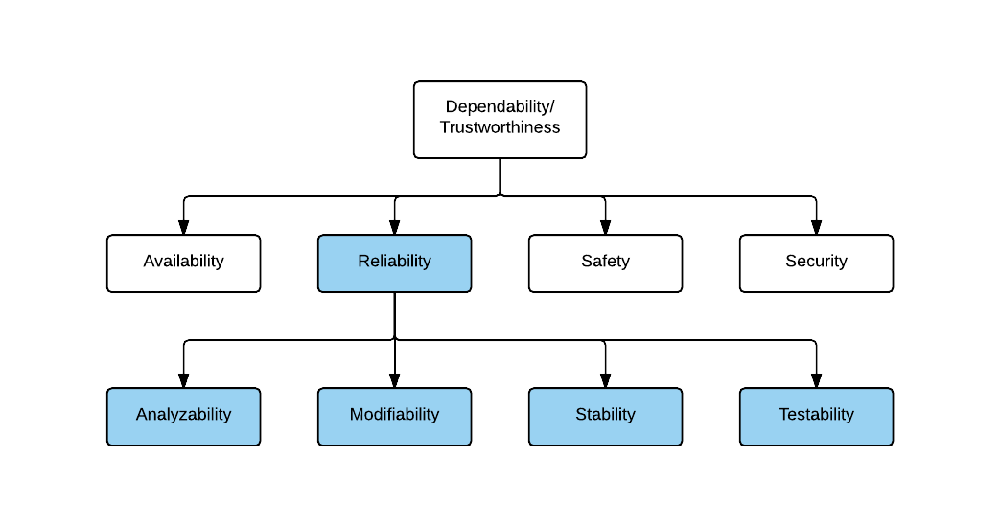
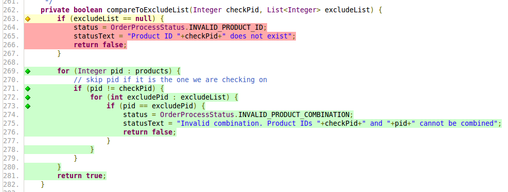
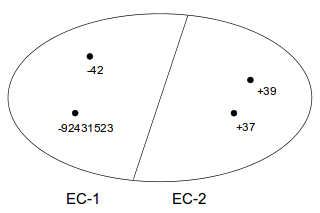
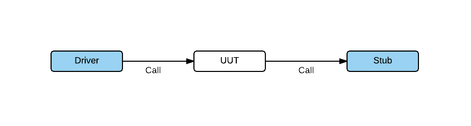
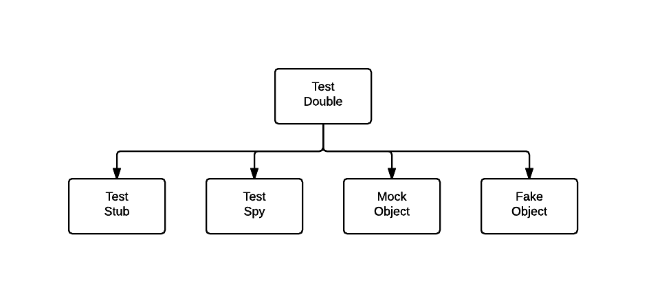
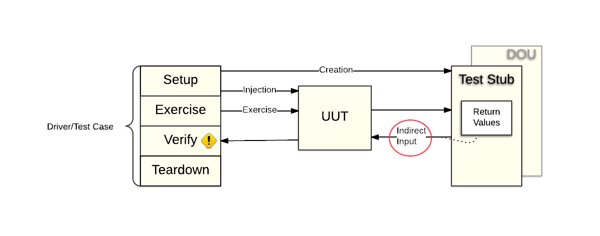
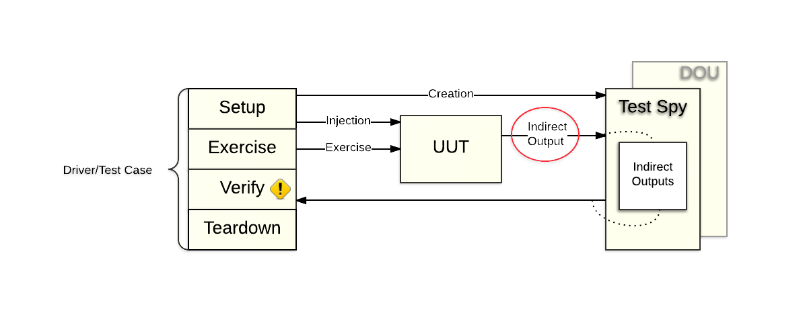
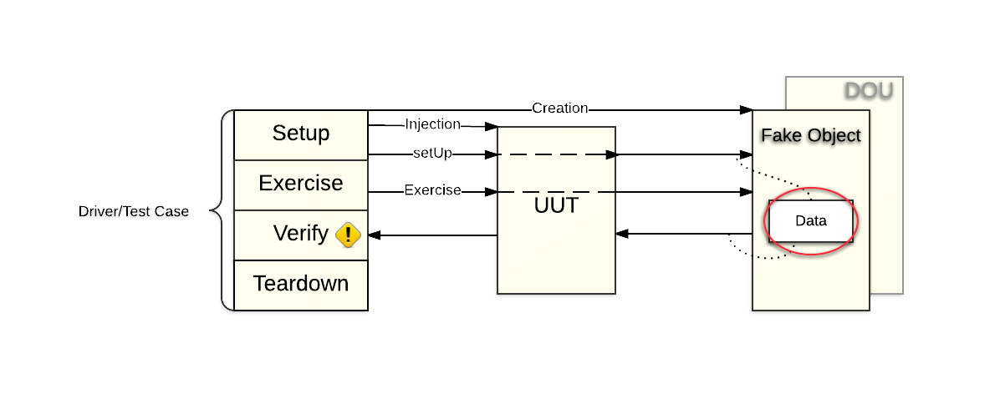
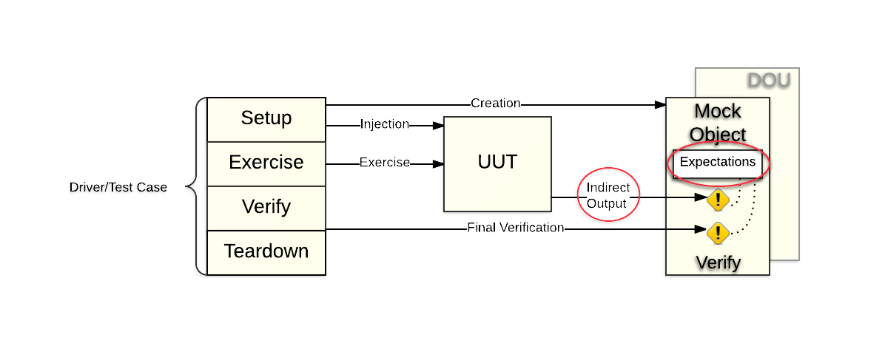

= Quality Attributes and Test Driven Development
:backend: deckjs
:deckjs_transition: fade
:deckjs_theme: web-2.0
:source-highlighter: prettify
:menu:
:customcss: custom.css

== What is software Quality Attributes?

[options="step"]
* *Availability*
** Concerned with the *probability that the system will be operational when needed*. 
* *Reliability*
** Concerned with the ability of the *system to deliver services as specified*.
* *Safety*
** Concerned with the ability of the system *to operate without catastrophic failure*.
* *Security*
** Concerned with the systems *ability to withstand attacks/threats*.
* *Analyzability*
** Concerned with the *capability of the software to be diagnosed for causes of failures*.
* *Modifiability*
** Concerned with the *ease with which the system supports change and modifications*.
* *Stability*
** Concerned with the capability of *the software to avoid unexpected effects from modifications*.
* *Testability*
** Concerned with the *ease with which the software can be made to demonstrate its faults*.
* *Performance*
** Concerned with *how long it takes the system to respond when an event occurs*.
* *Usability*
** Concerned with *how easy it is for the user to accomplish a desired task* and the kind of user support the system provides.
* *And more...*

== Tree of Qualities and Sub-qualities

== “We want them all!”

Many qualities are in direct conflict – they must be balanced

* modifiability and performance
** many delegations costs in execution speed – and memory footprint
* cost and reusability
** highly flexible software costs time, effort, and money
* security and availability
** availability through redundancy – increase opportunities of attack
* etc.

== There is no good or bad software!

* There is software that measure differently on the different qualities
** Fast but difficult to change
** Modifiable but performs less
** Etc.

== Terminology

[options="step"]
* Error
** mistake, misconception, or misunderstanding by developer
* Defect (bug)
** anomaly in software that may cause it to behave incorrectly, and not according to specification
* Failure
** inability of software unit to perform its required functions within specified performance requirements

=== Relations

Failure = behavioural malfunction (run-time)

Defect = code anomaly (compile-time)

Does defects lead to failure?

Not always. Not all defects leads to failures and not all failures occurs because of a defect.

== Reliability and failure

*Another definition of Reliability:*
Probability that a software system will not cause the failure of the system for a specified time under specified conditions.

=== Ensuring Reliability

Reliability is compromised by failures. Failures happen when the system is in an error state, which may be caused by a defect. So – reliability can be enhanced by several measures.

* *Fault avoidance* simply avoid introducing defects!
* *Fault detection and removal* Find and remove the defects before they cause failures.
* *Fault tolerance* Ensure that defects does not lead to failures.

== Fault avoidance

Use methods, tools, languages, techniques that are known to minimize the probability of introducing defects.

*That is:* Never use C or C++ or PHP for that matter :)

Use safe languages (Java, C#, etc.)

Use proven design techniques

* encapsulation, favor object composition over class inheritance, design patterns, etc.

== Fault detection and removal

Hunt down the defects by whatever means (automated tests, review) and remove them.

== Fault tolerance

We know that we cannot remove all defects, but we can do something to ensure they don't lead to failures.

* Replication and fail-over
* Graceful degradation
* Decoupling middleware
* etc.

== So far

Quality is many things and there are several views on quality, all, however, must deal with Reliability.

* *Reliability:* Probability that a software system will not cause the failure of the system for a specified time under specified conditions.

Reliability techniques

* fault avoidance, *fault detection and removal*, fault tolerance

Not all tests are equalliy important for reliability, so, the testing "budget" should be used wisely.

=== We use testing to help ensure reliability.

== But first some clerification

[options="step"]
*What is Review?*

[options="step"]
* Review of code, requirement specificaiton, system design, system architecture
** Defects can occur in all of the above

[options="step"]
*What is Unit Testing?*

[options="step"]
* Is an automated black-box testing technique with the goal of revealing defects in individual software units
** In my opinion, a software unit is a single class

[options="step"]
*What is Integration Testing?*

[options="step"]
* Is an automated black-box testing technique in which individual units are combined and tested as a group
** We integrate one unit into the group at a time
** *Methods* Big Bang, Top-down, Bottom-up

[options="step"]
*What is System Testing?*

[options="step"]
* Are tests conducted on a complete, integrated system to evaluate the system's compliance with its specified requirements
** Some types are:
*** _Usability testing_, _Performance testing_, _Stress testing_ (Over normal operation), _Load testing_ (Within normal operation), _Regression testing_, _Recovery testing_, _Scalability testing_, _Security testing_, _Smoke testing_, etc.

== Basic Principles of Testing

[options="step"]
* Testing is an execution based process with the intent of a) reveal defects b) evaluate quality
** finding failures by executing software units - and hopefully identify the defect that caused it
*** this is in contrast to inspection based processes like reviews
* A good test case has a high probability to reveal an undetected defect
** write as few tests as possible that will find as many defects as possible
* Test case must contain the expected output
** it is not something the tester should guess about
* Test cases should be developed for both valid and invalid input conditions
** it is often the error handling code that is tested least
* The probability of additional defects in a component is proportional to the number already detected in it
** due to high complexity or poor design
* Tests must be repeatable and reusable
** write them down clearly or even better: automate them
* Testing should be planned
** make plans and objectives for each type of testing
*** unit, integration, system
* Testing activities should be integrated into the software life cycle
* Creating good tests is a creative and challenging process

== Some psychology is involved

Humans are goal oriented.

* We want success and rewards and avoid failures

=== Think destructive!

Testing is a destructive process

* In contrast to almost all other software processes which are constructive
* Human psychology tells us "I want to be successful"

Instead of thinking *_I will prove my software works_* think like this indtead *_I will prove my software is really lousy_*

==== Reprogram your brain

*I am a success if I find a defect. The more I find, the better I am!*

== Test Driven Development

=== Key values

* *Keep focus*
** Make one thing only, at a time!
*** Often we think: Fixing this, requires fixing that, hey this could be smarter, fixing it, ohh, I could move that to a library...
* *Take small steps*
** Taking small steps allow you to backtrack easily when things becomes messy
*** Often: I can do it by introducing these two classes, humm, no no, I need a third, oh wait...
* *Speed*
** Deliver often, every 14 days is a good measure
** Speed, not by being sloppy but by making less functionality of superior quality
* *Simplicity*
** Maximize the amount of work _not done!_
*** Often: I can make a wonderful recursive solution parameterized for situations X, Y and Z

== A structured process

TDD replaces _tacit knowledge_ with a formulated process

* The TDD rhythm
** *five steps* that are each highly focussed and fast-paced iteration
* Testing principles
** The *testing principles* that defines a term for a specific action to make in each step

== The TDD Rhythm

* Add a small test
* Run all tests and see the new one fail
* Make a small change
* Run all tests and see them all succeed
* Refactor to remove duplications

All 5 steps makes one iteration. Each iteration is small, sypically adding a very small increment of behaviour to the system.

An iteration typically lasts from 1 to 15 minutes. If it is much bigger it is usually a sign that you are not taking _small steps_, and have lost _focus_.

== The TDD principles

[options="step"]
* *Automated tests*
** How do you test your software? Write an automated test
*** Often developers consider tests something stakeholders are interested in, and that tests are boring
*** But, tests are something that we should do for our own sake
**** to have confidence in our code
**** to dare change code radically
**** to know when we are done
**** to sleep better at night :)
* *Test First*
** When should we write our tests? Before we write the code that is to be tested. Because you don't test after :)
** Production code needs to be driven into existence, meaning that you as a developer need to be driven into writing production code because you need it for your tests
* *Test List*
** What should you test? Before you begin, write a list of all the test you know you will have to write. Add to the list as you find new potential tests

== The TDD principles

[options="step"]
* *One step test*
** Which test should you pick next from the list? Pick a test that will teach you something and that you are confident you can implement
* *Fake It (_Til you make it_)*
** What is your first implementation once you have a broken test? Return a constant. Once you have your test running, gradually transform it
*** Because it helps you keep focus, and you risk implementing a solution that is wrong and needs to be deleted a moment later, or you are lead to implementing all sorts of other code
*** Because you move faster by making small steps rapidly than running, fallling, and crawling back up all the time...
* *Trinagulation*
** How do you most conservatively drive abstraction with tests? Abstract only when you have two or more examples
*** The point is that one test case is not enough to ensure a reliable implementation when you have abstraction
*** e.g. if you make use of the _Fake it_ principle, you might have a method that returns a constant, because that is enough to make the test pass. The conservative way to drive a more correct implementation is to add more stories/scenarios => more test cases

== The TDD principles

[options="step"]
* *Isolated test*
** How should the running of tests affect one another? They should not
*** Isolated Test guards you against the _ripple effect_ meaning all tests fail because of one single problem
*** Isolate in order to review failure consequences
* *Evident data*
** How do you represent the intent of the data? Include expected and actual results in the test itself, and make their relationship apparent. You are writing tests for the reader, not just the computer. This way tests becomes a part of your documentation
* *Representative data*
** What data do you use for tests? Select a small set of data where each element represents a conceptual aspect or a special computational process
* *Assert first*
** When should you write the asserts? Write them first

== The TDD principles

[options="step"]
* *Obvious implementation*
** How do you implement simple operation? Just implement them
*** The _Fake it and Triangulation_ principles are great for driving algorithm development. However the really trivial code we simply implement
**** No need to test get/set methods or really simple methods, that is code of 3-5 lines of simple complexity
* *Evident tests*
** How do we avoid writing deffective tests? By keeping the testing code evident, readable, and as simple as possible
*** Avoid loops, conditions, recursion, and complexity in your tests
*** Keep test code as _dumb_ as possible because testing code is _code_ and you make mistakes in code :)
* *Regression test*
** What's the first thing you do when a defect is reported? Write the smallest possible test that fails and that, once run, will be repaired

== The TDD principles

[options="step"]
* *Break*
** What do you do when you feel tired or stuck? Take a break :)
* *Do over*
** What do you do when you are feeling losr? Throw away the code and start over

=== Conclusion

* TDD promises confidence for us as developers
** Green bar gives confidence
** Failing tests will tell you exactly where to look
** We dare to refactor and experiment because tests tell us if our ideas are good :)
** We have taken small steps, so getting back is easy and not as costly
* Reliability
** Code that is tested by good test cases is _much better_ than code that is not
** It is a _reflected practice_ instead of _devine inspiration_ and _black magic_ :)

== Systematic testing

Systematic testing is a planned systematic process with the explicit goal of finding defects in some well-defined part of the system

== White-box testing

*Definition:* The full implementation of the _unit under test_ (UUT) is known, so the actual code can be inspected in order to generate test cases.

We can make use of coverage tools, like jacoco, to check if all relevant coverage conditions has been tested.

== Black-box testing

*Definition:* The _unit under test_ (UUT) is treated as a black box. The only knowledge we have to gude our testing effort is the specification of the UUT and a general knowledge of common programming techniques, algorithmic constructs, and common mistakes made by programmers.

We have two black box techniques, that follows the TDD principle _Representative Data_:

* Equevalence class partitioning
* Boundry value analysis

== Equevalence class

*Definition:* A subset of all possible inputs to the UUT that has the property that if one element in the subset demonstrates a defect during testing, then we assume that all other elements in the subset will demonstrate the same defect.

=== Imagine we need to find test cases for Math.abs(x)

Math.abs(x): Absolute value of x

Will these 5 test cases ensure a reliable implementation?

.Unit under test: Math.abs
|===
|Input |Expected output

|x = 37
|37

|x = 38
|38

|x = 39
|39

|x = 40
|40
|===

=== Is the input representative?

* what is the probability that x=38 will find a defect that x=37 did not expose?
* what is the probability that there will be a defect in handling negative x? 

== Always use representative data in test cases

* We can find a single input value that represents a large set of values!

.Unit under test: Math.abs
|===
|Input |Expected output

|x = 37
|37

|x = -47
|47
|===

== Good rules to remember when creating tests

* *Coverage:* Every possible input element belongs to at least one of the equivalence classes
* *Representation:* If a defect is demonstrated on a particular member of an equivalence classes, the same defect is assumed to be demonstrated by any other member of the class

=== Some input values will make an algorithm give up, or crash your system

Sqrt(0), file.open("nonexistingfile"), division(0), exceptions, etc.

* Input values that leads to abnormal processing/giving up we classify as belonging to *invalid ECs*
* Those input values that process normally we say belong to *valid ECs*

=== Ranges, Sets, Booleans

* *Range:* If a condition is specified as a range of values, select one valid EC that covers the allowed range, and two invalid ECs, one above and one below the range
* *Set:* If a condition is specified as a set of values, then define an EC for each value in the set and one EC containing all elements outside the set
* *Boolean:* If a condition is specified as a boolean condition, then define one EC for the condition being _true_ and one EC for the condition being _false_

== Boundry value analysis

Experience shows that test cases focusing on boundary conditions have high payoff

* Some that spring into my mind is
** iteration over an array at its max size
** ”off by one” errors in comparisons 
*** if ( x < = MAX_SIZE ) and not if ( x < MAX_SIZE ) 
** null as value for a reference/pointer

*Definition:* A boundry value is an element that lies right on or next to the edge of an equivalance class

== Test doubles

*Stubs, Spies, and Fake Objects*

=== Motivation

Thorough testing requires objects to be tested in isolation to create a harness/environment where defects/complexity in other objects do not invalidate/complicate our testing.

== Test Doubles

*Definition:*

* Placeholder class until I get around to implement it properly
* *TDD:* temporary test stub = minimal compilable code

* _Superclass_ Test Double
** *SUT* System under test or *UUT* Unit under test
** *DOC* Depended-on Component or *DOU* Depended-on Unit

* Why use them?
** Slow tests
** DOU is:
*** *not available* (not developed yet)
*** *not under test control* (basically all integration points, e.g. Databases, REST APIs, etc.)
*** *has side-effects* (contaminates database, sets off an alarm, etc.)
*** *can throw exceptions which are otherwise hard to provoke*

== Classification

== Test Stubs

How can we verify logic independently when it depends on indirect inputs from other software components?

*We replace a real object with a test-specific object that feeds the desired indirect inputs into the system under test in order to have control of the DOU return data.*

[options="step"]

[options="step"]
* *Focus on indirect input*
* *When to use Test Stubs?*
** When the DOU is not developed yet (Often used in TDD in order to keep focus)
** When the DOU is not under test control (E.g. integration points like REST APIs and Databases.)
** When we want to test how the UUT reacts to specific return data from the DOU (E.g. clocks, temperatures, alarms, etc.)
** When we want to test how the UUT reacts to different exceptions thrown by the DOU
* These are all examples of indirect input to the UUT

== Test Spy

How do we implement Behavior Verification?

How can we verify logic independently when it has indirect outputs to other software components?

*Use a Test Double to capture the indirect output calls made to another component by the unit under test (UUT) for later verification by the test.*

[options="step"]

[options="step"]
* *Focus on indirect output*
* *When to use Test Spy?*
** When we want to record/log how the UUT interacts with the DOU
** When we want to verify that the UUT makes the correct calls in the right order to the DOU
** When we don't think a Mock Object is sufficiently intent-revealing, or we simply don't have a mock framework available
* *This allows us to do behaviour verificaiton in our test driver*

== Fake Object

How can we verify logic independently when depended-on objects cannot be used?

How can we avoid Slow Tests?

*Replace a component that the unit under test (UUT) depends on with a much lighter-weight implementation.*

[options="step"]

[options="step"]
* *Implements light-weight semi-realistic behaviour*
* *When to use Fake Objects?*
** When the UUT depends on other components which makes testing difficult or slow
** When the tests need complex sequences of behavior than is worth implementing in a Test Stub or Mock Object
** If we need to control either the indirect inputs or indirect outputs of the UUT, we should probably be using a Mock Object or Test Stub instead
* *Some specific situations where we replace the real component with a Fake Object are:*
** Fake Database, In-Memory Database (e.g. H2), Fake Web Service,  Fake Service Layer

== Mock Object

How do we implement Behavior Verification for indirect outputs of the UUT?

How can we verify logic independently when it depends on indirect inputs from other software components?

*Replace an object the unit under test (UUT) depends on with a test-specific object that verifies it is being used correctly by the UUT.*

[options="step"]

[options="step"]
* *Focus on indirect output*
* *When to use Mock Objects?*
** We can use a Mock Object as an observation point when we need to do Behavior Verification (Much like a Spy, but where verification is specified in the Mock Object)
** When we want to verify that the UUT makes the correct calls in the right order and with the correct parametrs to the DOU
* *Often Mock frameworks use Mock Objects to test on indirect input, in this case the Mock is actually behaving like a Test Stub rather than a Mock Object*

== Test Doubles Summary

* Testing units in isolation is important
** unit and integration testing
** test-driven development

* Units have more inputs and outputs than visible from the parameter list and instances variables
** especially true in object-oriented programming
** indirect inputs: data from DOUs to the UUT
** indirect output: data to DOUs from the UUT

*Test Doubles* allow you to get access to, inspect, and verify indirect input and output

* *Stub:* focus on indirect input
* *Spy:*  focus on indirect output (record/verify)
* *Fake object:* light-weight semi-realistic behaviour
* *Mock:* focus on indirect output (fail fast)
** frameworks to generate doubles dynamically

== Conclusion

In order to make your software more flexible and reliable

* Make the TDD rythm and TDD principle a part of your development life-cycle
* Make use of both white-box and black-box testing
* Make sure your test data is representative by thinking in equivalance classes
* Make sure to test data boundries
* *Test both valid and invalid equivalance classes*, _do not only test the happy path_
* Make use of test doubles in order to test software units in isolation
* And finally...

=== Testing shows the presence, not the absence of bugs

* Some resources:
** _Test doubles_ http://xunitpatterns.com/Test%20Double%20Patterns.html
** _Martin Fowler_ http://martinfowler.com/articles/mocksArentStubs.html
** _Spock Github_ https://github.com/spockframework/spock
** _Spock Wikis_  https://code.google.com/p/spock/w/list
** _Spock Handbook_ https://leanpub.com/spockframeworknotebook/read

== Mockito vs. Spock

[source,java]
----
@Test
public void shouldFetchWeatherForecastFromGlobalServiceIfNotAvailableLocally() {
    WeatherService localWeatherService = Mockito.mock(WeatherService.class); // <1>
    WeatherService globalWeatherService = Mockito.mock(WeatherService.class);

    WeatherForecast forecast = new WeatherForecast(globalWeatherService, localWeatherService); // <2>

    Mockito.when(localWeatherService.hasForecastFor(anyString())) // <3>
           .thenReturn(false);

    Weather forecastedWeather = new Weather();

    Mockito.when(globalWeatherService.getWeather(anyString()))
           .thenReturn(forecastedWeather);
    
    Weather weather = forecast.getForecast("myCity");

    verify(localWeatherService, times(1)).hasForecastFor(anyString())); // <4>
    verify(globalWeatherService, times(1)).getWeather(anyString());

    assertThat(weather).isSameAs(forecastedWeather); // <5>
}
----
<1> Setup mocks
<2> UUT
<3> Setup rules for the mock
<4> Verify invocations and parameters 
<5> Assertion

== continued

[source,java]
----
void "Should fetch weather forecast from global service if not available locally"() {
    given:
    WeatherService localWeatherService = Mock(WeatherService) // <1>
    WeatherService globalWeatherService = Mock(WeatherService)
    def forecast = new WeatherForecast(globalWeatherService, localWeatherService) // <2>
    def forecastedWeather = new Weather()

    when:
    Weather weather = forecast.getForecast("myCity")

    then:
    1 * localWeatherService.hasForecastFor(_ as String) >> false // <3>
    1 * globalWeatherService.getWeather(_ as String) >> forecastedWeather

    and:
    weather == forecastedWeather // <4>
}
----
<1> Setup mocks
<2> UUT
<3> Setup rules and verify invocations and parameters 
<4> Assertion

== The Spock Testing Framework

*Demo*

